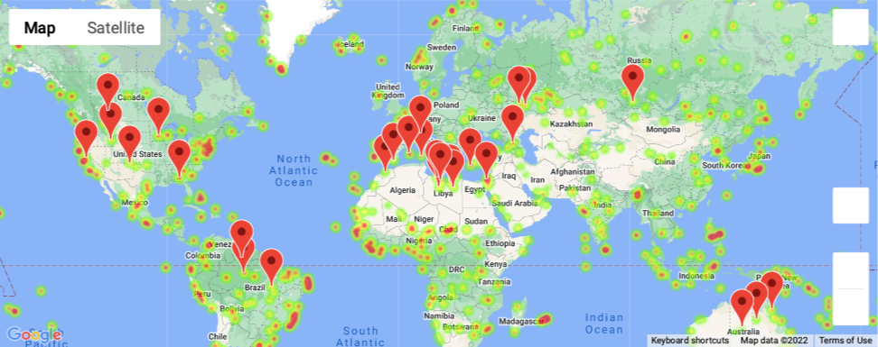

# Unit 6 Homework: What's the Weather Like?

## Background

Whether financial, political, or social&mdash;data's true power rests in its ability to answer questions definitively. So, let's take what you've learned about Python requests, APIs, and JSON traversals to answer a fundamental question: "What's the weather like as we approach the equator?"

Now, we know what you may be thinking: _"Duh. It gets hotter ..."_

But, if pressed, how would you **prove** it?

### Before You Begin

1. Create a new repository for this project called `python-api-challenge`. **Do not add this homework to an existing repository**.

2. Clone the new repository to your computer.

3. Inside your local Git repository, create a directory for both of the Python challenges. Use a folder name that corresponds to the challenges, such as **WeatherPy**.

4. Inside the folder you just created, add new files called `WeatherPy.ipynb` and `VacationPy.ipynb`. These will be the main scripts to run for each analysis.

5. Push the above changes to GitHub.


### Adding a .gitignore File

We don't want the `api_keys.py` file containing the API key to be exposed to the public on GitHub; this would mean anyone could copy and use our API key, possibly incurring charges.

When we type `git status` in the command line, we can see all the untracked files that we have created so far.

If we only wanted to add the `WeatherPy.ipynb` file to GitHub, we could type `git add WeatherPy.ipynb`. However, every time we want to add a new file or update current files to the repository, we would have to add each file individually, which is time-consuming and cumbersome. Instead, we can add the files that we don't want to track to the `.gitignore` file.

Before we add our files to GitHub, let's add `api_keys.py` to the `.gitignore` file. Use the following instructions:

1. Open your `python-api-challenge` GitHub folder in VS Code.

2. Open the `.gitignore` file, and on the first line, type the following code:

```python
# Adding config.py file.
api_keys.py
```

3. While the `.gitignore` file is open, add the `API_practice.ipynb` and `random_numbers.ipynb` files and save the file.

4. In the command line, type `git status` and press Enter. The output should indicate that the `.gitignore` file has been modified and the `WeatherPy.ipynb` file is untracked.

5. Use `git add`, `git commit`, and `git push` to commit the modifications to `.gitignore` and the `WeatherPy.ipynb` file to GitHub.

On GitHub, the only new file you should find is the `WeatherPy.ipynb` file.


## Part 1: WeatherPy

In this section, you'll create a Python script to visualize the weather of 500+ cities of varying distance from the equator. To do so, you'll use a [simple Python library](https://pypi.python.org/pypi/citipy), the [OpenWeatherMap API](https://openweathermap.org/api), and your problem-solving skills to create a representative model of weather across cities.

The first requirement is to create a series of scatter plots to showcase the following relationships:

* Temperature (F) vs. Latitude

* Humidity (%) vs. Latitude

* Cloudiness (%) vs. Latitude

* Wind Speed (mph) vs. Latitude


After each plot, add a sentence or two explaining what the code is analyzing.

The second requirement is to compute the linear regression for each relationship. This time, separate the plots into Northern Hemisphere (greater than or equal to 0 degrees latitude) and Southern Hemisphere (less than 0 degrees latitude):

* Northern Hemisphere - Temperature (F) vs. Latitude

* Southern Hemisphere - Temperature (F) vs. Latitude

* Northern Hemisphere - Humidity (%) vs. Latitude

* Southern Hemisphere - Humidity (%) vs. Latitude

* Northern Hemisphere - Cloudiness (%) vs. Latitude

* Southern Hemisphere - Cloudiness (%) vs. Latitude

* Northern Hemisphere - Wind Speed (mph) vs. Latitude

* Southern Hemisphere - Wind Speed (mph) vs. Latitude


After each pair of plots, explain what the linear regression is modeling. For example, describe any relationships that you notice and any other findings you may have.

Your final notebook must:

* Randomly select **at least** 500 unique (non-repeated) cities based on latitude and longitude.
* Perform a weather check on each of the cities using a series of successive API calls.
* Include a print log of each city as it's being processed, with the city number and city name.
* Save a CSV of all retrieved data and a PNG image for each scatter plot.

### Part 2: VacationPy

Now, let's use your skills working with weather data to plan future vacations. Use Jupyter-gmaps and the Google Places API for this part of the assignment.

* **Note:** Remember that any API usage beyond the $200 credit will be charged to your personal account. You can set quotas and limits to your daily requests to be sure you can't be charged. Check out [Google Maps Platform Billing](https://developers.google.com/maps/billing/gmp-billing#monitor-and-restrict-consumption) and [Manage your cost of use](https://developers.google.com/maps/documentation/javascript/usage-and-billing#set-caps) for more information.

* **Note:** If you are having trouble displaying the maps, run `jupyter nbextension enable --py gmaps` in your environment and then retry.

To complete this part of the assignment, you will need to do the following:

* Create a heat map that displays the humidity for every city from Part 1, as in the following image:

  

* Narrow down the DataFrame to find your ideal weather condition. For example:

  * A max temperature lower than 80 degrees but higher than 70.

  * Wind speed less than 10 mph.

  * Zero cloudiness.

  * Drop any rows that don't satisfy all three conditions. You want to be sure the weather is ideal.

  * **Note:** Feel free to adjust your specifications, but make sure to limit the number of rows returned by your API requests to a reasonable number.

* Use Google Places API to find the first hotel for each city located within 5,000 meters of your coordinates.


* Plot the hotels on top of the humidity heatmap, with each pin containing the **Hotel Name**, **City**, and **Country**, as in the following image:

  
  
  

As final considerations:

* You must complete your analysis using a Jupyter notebook.
* You must use the Matplotlib or Pandas plotting libraries.
* For Part 1, you must include a written description of three observable trends based on the data.
* For Part 2, you must take a screenshot of the heatmap that you create and include it in your submission.
* Your plots must include labeling aspects like plot title (with date of analysis) and axis labels.
* For max intensity in the heatmap, try setting it to the highest humidity found in the dataset.

## Hints and Considerations

* The city data that you generate is based on random coordinates and different query times, so your outputs will not be an exact match to the provided starter notebook.

* If you'd like a refresher on the geographic coordinate system, [this site](http://desktop.arcgis.com/en/arcmap/10.3/guide-books/map-projections/about-geographic-coordinate-systems.htm) has great information.

* Next, take some time to study the OpenWeatherMap API. Based on your initial study, you should be able to answer basic questions about the API: Where do you request the API key? Which Weather API in particular will you need? What URL endpoints does it expect? What JSON structure does it respond with? Before you write a line of code, you should have a crystal-clear understanding of your intended outcome.

* A starter code for citipy has been provided. However, if you're craving an extra challenge, push yourself to learn how it works: [citipy Python library](https://pypi.python.org/pypi/citipy). Before you try to incorporate the library in your analysis, start with simple test cases outside your main script to confirm that you are using it correctly. Often, when introduced to a new library, students will spend hours trying to figure out errors in their code&mdash;a simple test case can save you a lot of time and frustration.

* You will need to apply your critical thinking skills to understand how and why we're recommending the tools we are. What is citipy used for? Why would you use it in conjunction with the OpenWeatherMap API? How would you do so?

* While building your script, pay attention to the cities you are using in your query pool. Are you covering the full range of latitudes and longitudes? Or are you choosing 500 cities from one region of the world? Even if you were a geography genius, simply listing 500 cities based on your personal selection would create a biased dataset. Try to think of ways that you can counter this. 

  * **Hint:** Consider the full range of latitudes.

* Once you have computed the linear regression for one relationship, you will follow a similar process for all other charts. As a bonus, try to create a function that will create these charts based on different parameters.

* Remember that each coordinate will trigger a separate call to the Google API. If you're creating your own criteria to plan your vacation, try to reduce the results in your DataFrame to 10 or fewer cities.

* Ensure your repository has regular commits and a thorough README.md file.

* Lastly, remember that this is a challenging activity. Push yourself! If you complete this task, you can safely say that you've gained a strong understanding of the core foundations of data analytics, and it will only get better from here. Good luck!


© 2022 Trilogy Education Services, a 2U, Inc. brand. All Rights Reserved.


